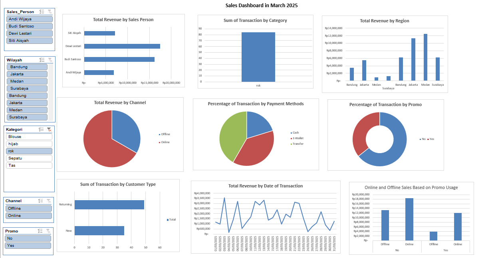
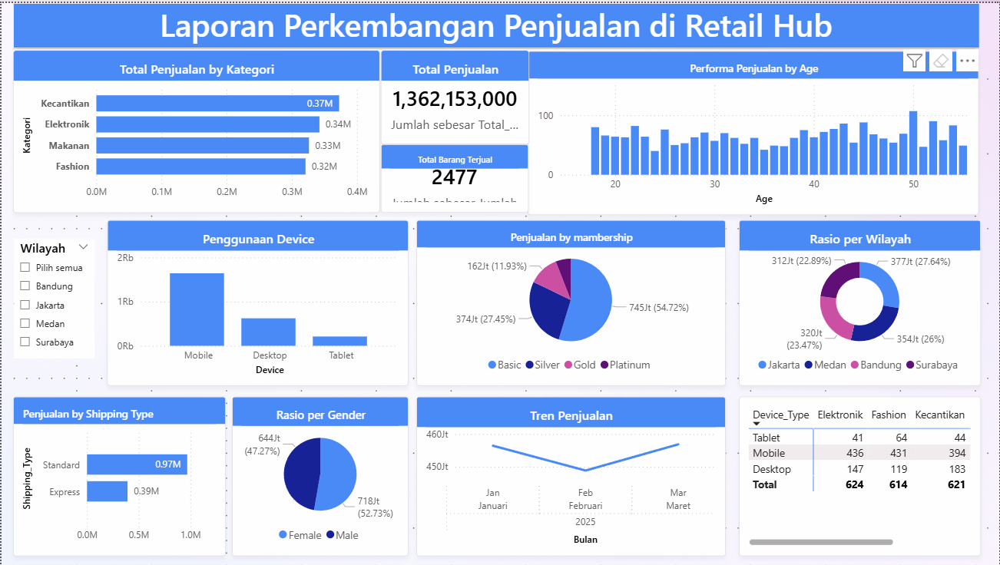

# From Data to Dashboard: Retail Sales Intelligence (Excel & Power BI)

> **The same dataset. Two tools. A story that gets sharper at every layer.**  
> This project transforms 400+ raw retail transactions into a two-stage analytical system: starting with Excel for hands-on pivot analysis, then advancing to Power BI for enterprise-grade interactivity, DAX-powered metrics, and time intelligence.

---

## The Business Context

A fashion retail business operating across four Indonesian cities needed clarity on its March 2025 performance. Four sales representatives. Two channels. Five product categories. Hundreds of transactions and no clear picture of what was actually driving revenue.

**The questions this project answers:**

- Which sales person and region are leading and by how much?
- Does running promotions generate incremental revenue, or just shift timing?
- Is the customer base growing, or is the business running on retention alone?
- How does performance move across the month peaks, troughs, momentum?

---

## Two-Stage Analytical Approach

This project was built in two deliberate layers. Each tool was chosen for what it does best.

```
[ Stage 1 — Excel ]                        [ Stage 2 — Power BI ]
  Raw data cleaning                           DAX calculated measures
  9 Pivot Tables                              Drill-down interactivity
  10 Charts                                   Time intelligence (MTD, growth %)
  Slicer-based filtering                      Cross-visual dynamic filtering
  ─────────────────────────────────────────────────────────────────
  Foundation: understand the data             Extension: interrogate the data
```

> Excel answers "what happened." Power BI answers "why, where, and what next."

---

## Dataset

| Field | Detail |
|---|---|
| **Period** | March 2025 (1–31 March) |
| **Volume** | ~400+ sales transactions |
| **Sales Persons** | Andi Wijaya · Budi Santoso · Dewi Lestari · Siti Aisyah |
| **Regions** | Jakarta · Bandung · Surabaya · Medan |
| **Product Categories** | Hijab · Blouse · Rok · Sepatu · Tas |
| **Channels** | Online · Offline |

---

## Stage 1: Excel Dashboard

### What Was Built

| Layer | Detail |
|---|---|
| **Data Cleaning** | Standardized inconsistent casing, trimmed whitespace, enforced uniform labels |
| **Pivot Tables** | 9 tables across sales person, region, category, channel, promo, payment, customer type, date |
| **Charts** | 10 charts: bar, column, donut, line, stacked bar — each mapped to a specific business question |
| **Slicers** | 5 global filters (Sales Person, Wilayah, Kategori, Channel, Promo) wired to all charts |
| **Dashboard** | Single-canvas executive layout |

### Dashboard Preview



### Pivot Tables

| # | Pivot Table | Metric |
|---|---|---|
| 1 | Sales Person Performance | Total Penjualan |
| 2 | Category Volume | Count of Transactions |
| 3 | Regional Revenue | Total Penjualan |
| 4 | Channel Distribution | Count of Transactions |
| 5 | Promo vs Non-Promo | % Contribution |
| 6 | Payment Method Mix | Count of Transactions |
| 7 | Customer Type Split | Count of Transactions |
| 8 | Daily Sales Trend | Total Penjualan over time |
| 9 | Promo × Channel | Cross-tab interaction |

### Charts

| # | Chart | Type | Business Question |
|---|---|---|---|
| 10 | Sales by Sales Person | Horizontal Bar | Who is the top performer? |
| 11 | Sales by Category | Column | What sells most? |
| 12 | Sales by Region | Column | Where is revenue concentrated? |
| 13 | Online vs Offline | Donut | How are channels split? |
| 14 | Promo vs Non-Promo | Donut | Do promos drive meaningful share? |
| 15 | Payment Method | Donut | How do customers prefer to pay? |
| 16 | New vs Returning Customer | Bar | Is retention healthy? |
| 17 | Sales Trend by Date | Line | What does momentum look like? |
| 18 | Promo × Channel | Stacked Bar | Where does promo impact land? |

---

## Stage 2: Power BI Dashboard

### Why Power BI, and Why It Matters

Excel established the analytical baseline. Power BI was introduced to go further adding three capabilities that Excel fundamentally cannot replicate at scale:

**1. DAX Calculated Measures**
Custom metrics built beyond raw aggregation: revenue contribution %, promo lift differential, and per-sales-person efficiency ratios. These aren't available through pivot tables alone.

**2. Drill-Down Interactivity**
Clicking any chart element dynamically filters every other visual on the canvas turning a static report into a live diagnostic tool. Select "Jakarta" in the region chart and every other visual instantly scopes to Jakarta-only data.

**3. Time Intelligence**
Automated Month-to-Date (MTD) tracking and period-over-period growth metrics built with DAX time intelligence functions. This transforms the daily sales line from a passive trend view into an active performance tracker.

### Dashboard Preview



---

## Key Business Findings

These are not just observations they are decisions waiting to be made.

### 💰 Revenue is concentrated, not distributed
**Dewi Lestari** and **Budi Santoso** significantly outpaced peers. **Jakarta alone generated Rp 11.4M** nearly double Surabaya and Medan combined. The implication: before expanding to new cities, the business should diagnose what is working in Jakarta and systematically replicate it elsewhere.

### 🛒 Online wins volume. Offline wins value.
Online channel captured **56 transactions vs. 28 offline** a 2:1 ratio. But offline transactions carried higher individual ticket sizes. Scaling online without protecting offline risks trading margin for volume — a net negative for a fashion business where average order value matters.

### 👗 Rok leads volume, but category margin tells the full story
With **84 transactions**, Rok led all categories. Whether volume leadership translates to revenue leadership depends on average selling price per SKU a gap that the Power BI DAX measures are positioned to fill.

### 🔁 Early retention signal is real
**Returning customers (49) outnumbered new customers (35)** in the first month of observation. A 58% repeat rate in month one is a healthy anchor but the trend over subsequent months will reveal whether this is organic loyalty or the tail end of an acquisition campaign.

### 🎯 Promos are channelled online — but ROI is unverified
Promo transactions accounted for **~36% of all sales**, skewing disproportionately toward online. The business doesn't yet know whether these are incremental purchases or discounted replacements of full-price intent. The Promo × Channel cross-tab built in Stage 1 creates the foundation to answer this with the next month's data.

### 💳 Transfer dominates, but E-Wallet momentum is the trend to watch
Bank transfer led payment methods, followed by E-Wallet and Cash. As Indonesian consumers increasingly migrate to GoPay, OVO, and DANA, the payment method split is a leading indicator of digital customer maturity and a variable that affects checkout conversion rates.

---

## Skills Demonstrated

```
Data Cleaning & Standardization   →  Enforcing consistency before analysis
Excel Pivot Mastery                →  Multi-dimensional slicing across 9 analytical lenses
Dashboard Architecture             →  Single-canvas, slicer-connected, executive-ready layout
DAX (Power BI)                     →  Custom calculated measures beyond native aggregation
Time Intelligence                  →  MTD tracking and period-over-period growth
Drill-Down Interactivity           →  Dynamic cross-visual filtering
Business Storytelling              →  Translating numbers into decisions
```

---

## File Structure

```
From-Data-to-Dashboard-Visualizing-with-Excel/
├── README.md
├── .gitignore
├── data/
│   └── Jawaban_Weekly_Task_3_From_Data_to_Dashboard.xlsx
└── assets/
    ├── excel-dashboard.png
    └── powerbi-dashboard.png
```

---

## What's Next

March 2025 is the baseline. With recurring monthly data, this system evolves into:

- **Month-over-month trend tracking** is Jakarta's dominance growing or narrowing?
- **Promo ROI calculation** revenue lift vs. discount cost, broken down by channel
- **Sales person consistency analysis** one strong month vs. repeatable performance
- **Forecasting layer** extend to Python/Prophet for demand-side projection

---

## About

**Achmad Faishal**  
Ekonomi Pembangunan | FEB UPN "Veteran" Yogyakarta

[](https://www.linkedin.com/in/achmad-faishal-062313274/)

---

*Part of a broader data analytics portfolio spanning SQL (BigQuery), Python, forecasting, and BI dashboard development.*
